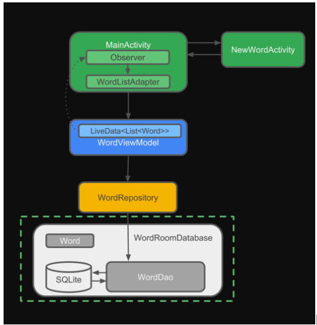

# 3.  Database

TBD: Kotlin Room Component from Google based on sqlite3

I refered to this [doc from google-developer](https://google-developer-training.github.io/android-developer-advanced-course-practicals/unit-6-working-with-architecture-components/lesson-14-room,-livedata,-viewmodel/14-1-a-room-livedata-viewmodel/14-1-a-room-livedata-viewmodel.html)

And the diagram as below picture:

<table>
<tbody>
<tr>
<td>

</td>
</tr>
</tbody>
</table>
